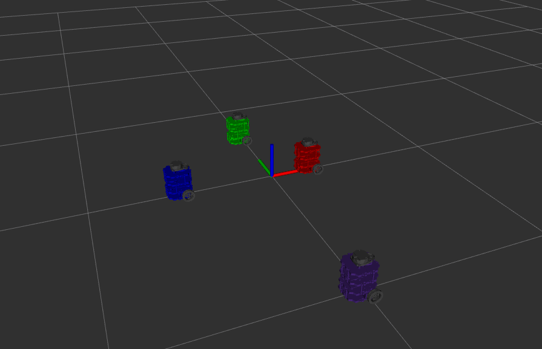
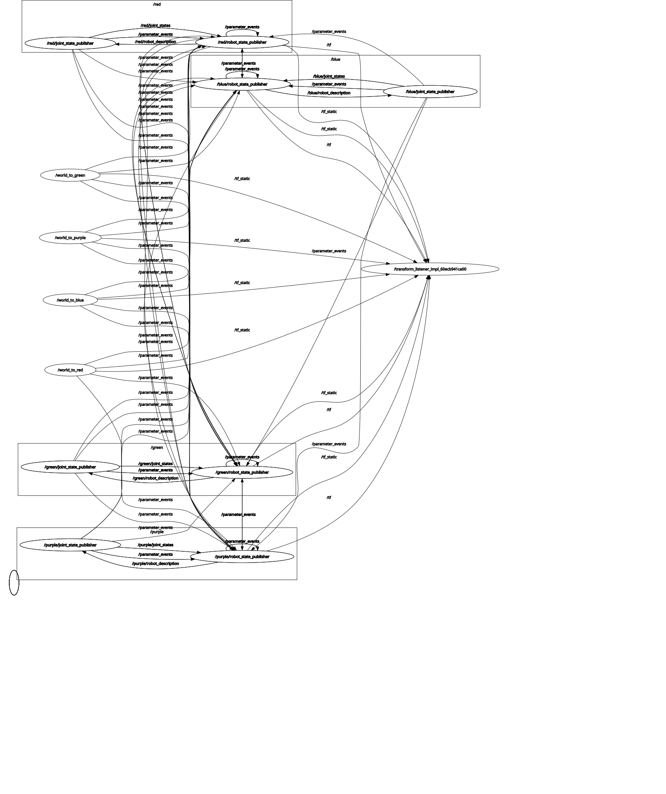
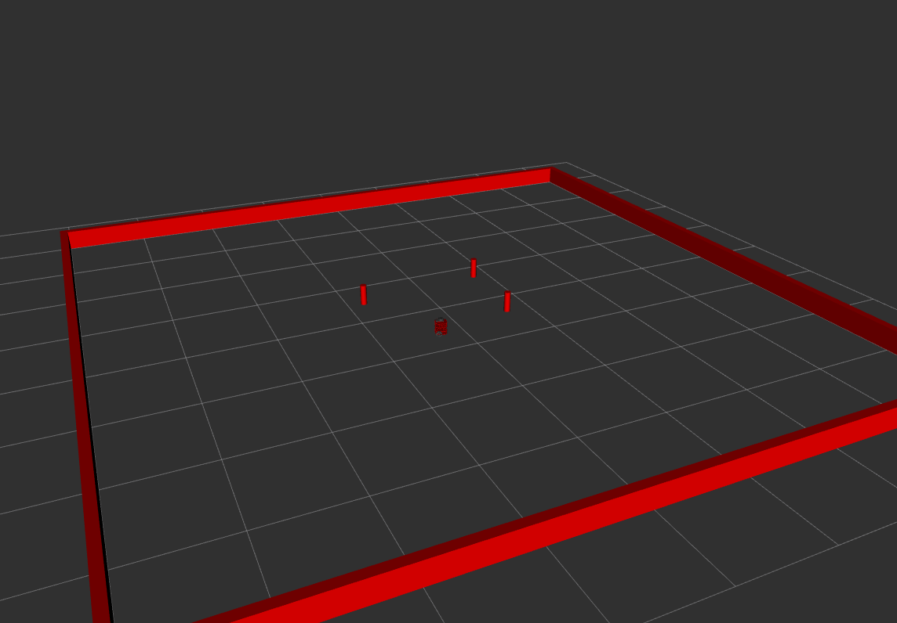

# ME495 Sensing, Navigation and Machine Learning For Robotics
* Chenyu Zhu
* Winter 2025
# Package List
This repository consists of several ROS packages
- Nuturtle Description - describle and show multiple turtlerobots on rviz
- turtlelib - contains useful functions for geometry calculations
- nusim - load the arena with walls and obstacles, and put robot in it


# Nuturtle  Description
URDF files for Nuturtle RapidBot
* `ros2 launch nuturtle_description load_one.launch.xml` to see the robot in rviz.
* `ros2 launch nuturtle_description load_all.launch.xml` to see four copies of the robot in rviz.

* The rqt_graph when all four robots are visualized (Nodes Only, Hide Debug) is:


# Turtlelib
A useful library for geometry calculations
* `angle.hpp` deal with angle calculations
* `geometry.hpp` basic calculations for 2D vectors and points
* `se2d.hpp` calculations regarding transformation
* `diff_drive.hpp` kinematics functions of a diff-drive robot

# Nusim
A world creator and load turtlebots in it
* `ros2 launch nusim nusim.launch.xml` to create the world.


| Parameter | Type | Default | Description |
|-----------|------|---------|-------------|
| `rate` | double | 100.0 | Simulation update rate in Hz |
| `x0` | double | 0.0 | Initial x position of the robot |
| `y0` | double | 0.0 | Initial y position of the robot |
| `theta0` | double | 0.0 | Initial orientation of the robot (radians) |
| `arena_x_length` | double | 8.0 | Length of the arena in the x direction (meters) |
| `arena_y_length` | double | 8.0 | Length of the arena in the y direction (meters) |
| `obstacles.x` | double[] | [] | List of x coordinates for obstacles |
| `obstacles.y` | double[] | [] | List of y coordinates for obstacles |
| `obstacles.r` | double | 0.2 | Radius of all obstacles (meters) |

# Nuturtle Control
This package controls the real turtle robot
* `circle.hpp` drive the robot in a circle
* `odometry.hpp` convert joint states into odometry information
* `turtle_control.hpp` drive wheels and get wheels positions

# Nuturtle Msgs
This package contains useful messages for the turtle robot

# Launch File Details
* `ros2 launch nuturtle_description load_one.launch.xml --show-args`
  ```bash
  Arguments (pass arguments as '<name>:=<value>'):

    'use_rviz':
        Open rviz
        (default: 'true')

    'use_jsp':
        Use joint state publisher
        (default: 'true')

    'color':
        One of: ['red', 'green', 'blue', 'purple']
        (default: 'purple')
  ```
* `ros2 launch nuturtle_description load_all.launch.xml --show-args`
  ```bash
  Arguments (pass arguments as '<name>:=<value>'):

    'use_rviz':
        Open rviz
        (default: 'true')

    'use_jsp':
        Use joint state publisher
        (default: 'true')

    'world_frame':
        Select world frame
        (default: 'nusim/world')

    'color':
        One of: ['red', 'green', 'blue', 'purple']
        (default: 'purple')
  ```
  
  [](https://github.com/user-attachments/assets/7a3695a2-e658-4960-9db1-97ebaf027cb2)


  [](https://github.com/user-attachments/assets/7b79d5f1-7803-4adb-b0d5-2778ddb19b9f)