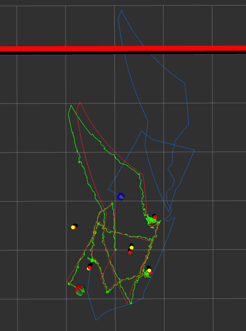

# ME495 Sensing, Navigation and Machine Learning For Robotics
**Chenyu Zhu — Winter 2025**

EKF SLAM pipeline running on a real TurtleBot3, with landmark detection, odometry, and a full two-machine ROS2 setup.

## Real Robot Demo

[](https://www.youtube.com/watch?v=vrTNOKXWeiI)

The robot drives a circuit and returns to its starting position. The green robot is the SLAM estimate, the blue robot is raw odometry.

## SLAM Pose Error (Unknown Data Association)

| Comparison | x (m) | y (m) | Total (m) |
|---|---|---|---|
| Actual vs Odometry | 0.633 | 0.176 | 0.657 |
| Actual vs SLAM | 0.001 | 0.000 | 0.001 |

## Packages

### [nuslam](nuslam/README.md)
EKF SLAM with unknown data association. Detects cylindrical landmarks from LiDAR scan clusters using circle fitting, then runs an EKF to correct the robot's pose estimate. Supports both simulation and real robot.

```
# On the TurtleBot
ros2 launch nuslam turtlebot_bringup.launch.xml

# On the PC
ros2 launch nuslam pc_bringup.launch.xml
```

### nuturtle_control
Controls the real TurtleBot3 hardware. Converts `cmd_vel` to wheel commands (`turtle_control`), integrates wheel encoders into odometry (`odometry`), and provides a circle-driving mode (`circle`).

### nusim
Simulator for the TurtleBot3. Creates an arena with configurable walls and cylindrical obstacles, simulates encoder noise, and publishes a fake LiDAR scan.

```
ros2 launch nusim nusim.launch.xml
```

### nuturtle_description
URDF and launch files for visualizing the TurtleBot3. Supports launching one or multiple colored robot instances simultaneously.

```
ros2 launch nuturtle_description load_one.launch.xml
ros2 launch nuturtle_description load_all.launch.xml
```

### turtlelib
C++ geometry library used across packages. Provides 2D rigid body transforms (SE2), twist/wrangle operations, and differential drive kinematics.

## Simulation



[Simulation video — SLAM with known data association](https://github.com/user-attachments/assets/7a3695a2-e658-4960-9db1-97ebaf027cb2)

[Simulation video — SLAM with unknown data association](https://github.com/user-attachments/assets/7b79d5f1-7803-4adb-b0d5-2778ddb19b9f)
