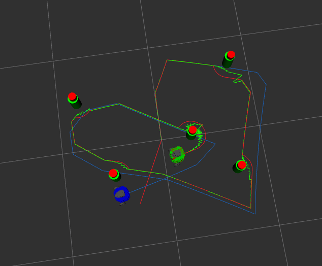

# NuSLAM

EKF SLAM with unknown data association using laser scan landmark detection.

## Description

NuSLAM implements Extended Kalman Filter (EKF) SLAM on a TurtleBot3 using:
- **Landmark detection**: Circle fitting on LiDAR scan clusters to detect cylindrical landmarks
- **Unknown data association**: Mahalanobis distance to match observed landmarks to the EKF map
- **Two-machine setup**: Robot runs hardware drivers and landmark detection; PC runs EKF SLAM and visualization

### Launch

On the TurtleBot:
```
ros2 launch nuslam turtlebot_bringup.launch.xml
```

On the PC:
```
ros2 launch nuslam pc_bringup.launch.xml
```

## Real Robot Demo

[](https://www.youtube.com/watch?v=vrTNOKXWeiI)

## Pose Error (Unknown Data Association)

Simulation results after driving a circuit and returning to start:

| Comparison | x (m) | y (m) | Total (m) |
|---|---|---|---|
| Actual vs Odometry | 0.633 | 0.176 | 0.657 |
| Actual vs SLAM | 0.001 | 0.000 | 0.001 |

## Simulation



[Simulation Video](https://github.com/user-attachments/assets/3adef315-02b5-492d-bb40-f951f29c4584)
